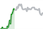

Bushra commits here
# Phase-One-Group-Project

                

                    
                    Bitcoin - BTC
                    <!--add cash sign via dom, string interpolation-->
                    $26000
                    
                    5.42% 
                    <small>supply</small>
                    
                    566777
                    <small>mkt cap</small>
                    
                    <button type="button" class="btn btn-light" id = 'addToCartInCardButton'>
                        <svg xmlns="http://www.w3.org/2000/svg" width="30" height="30" fill="currentColor" class="bi bi-cart" viewBox="0 0 16 16">
                            <path d="M0 1.5A.5.5 0 0 1 .5 1H2a.5.5 0 0 1 .485.379L2.89 3H14.5a.5.5 0 0 1 .491.592l-1.5 8A.5.5 0 0 1 13 12H4a.5.5 0 0 1-.491-.408L2.01 3.607 1.61 2H.5a.5.5 0 0 1-.5-.5zM3.102 4l1.313 7h8.17l1.313-7H3.102zM5 12a2 2 0 1 0 0 4 2 2 0 0 0 0-4zm7 0a2 2 0 1 0 0 4 2 2 0 0 0 0-4zm-7 1a1 1 0 1 1 0 2 1 1 0 0 1 0-2zm7 0a1 1 0 1 1 0 2 1 1 0 0 1 0-2z"/>
                          </svg>Add to Cart</button> 
              

          

          

            

                
                Bitcoin - BTC
                <!--add cash sign via dom, string interpolation-->
                $26000
                
                5.42% 
                <small>supply</small>
                
                566777
                <small>mkt cap</small>
                
                <button type="button" class="btn btn-light" id = 'addToCartInCardButton'>
                    <svg xmlns="http://www.w3.org/2000/svg" width="30" height="30" fill="currentColor" class="bi bi-cart" viewBox="0 0 16 16">
                        <path d="M0 1.5A.5.5 0 0 1 .5 1H2a.5.5 0 0 1 .485.379L2.89 3H14.5a.5.5 0 0 1 .491.592l-1.5 8A.5.5 0 0 1 13 12H4a.5.5 0 0 1-.491-.408L2.01 3.607 1.61 2H.5a.5.5 0 0 1-.5-.5zM3.102 4l1.313 7h8.17l1.313-7H3.102zM5 12a2 2 0 1 0 0 4 2 2 0 0 0 0-4zm7 0a2 2 0 1 0 0 4 2 2 0 0 0 0-4zm-7 1a1 1 0 1 1 0 2 1 1 0 0 1 0-2zm7 0a1 1 0 1 1 0 2 1 1 0 0 1 0-2z"/>
                      </svg>Add to Cart</button> 
          

      

      

        

            
            Bitcoin - BTC
            <!--add cash sign via dom, string interpolation-->
            $26000
            
            5.42% 
            <small>supply</small>
            
            566777
            <small>mkt cap</small>
            
            <button type="button" class="btn btn-light" id = 'addToCartInCardButton'>
                <svg xmlns="http://www.w3.org/2000/svg" width="30" height="30" fill="currentColor" class="bi bi-cart" viewBox="0 0 16 16">
                    <path d="M0 1.5A.5.5 0 0 1 .5 1H2a.5.5 0 0 1 .485.379L2.89 3H14.5a.5.5 0 0 1 .491.592l-1.5 8A.5.5 0 0 1 13 12H4a.5.5 0 0 1-.491-.408L2.01 3.607 1.61 2H.5a.5.5 0 0 1-.5-.5zM3.102 4l1.313 7h8.17l1.313-7H3.102zM5 12a2 2 0 1 0 0 4 2 2 0 0 0 0-4zm7 0a2 2 0 1 0 0 4 2 2 0 0 0 0-4zm-7 1a1 1 0 1 1 0 2 1 1 0 0 1 0-2zm7 0a1 1 0 1 1 0 2 1 1 0 0 1 0-2z"/>
                  </svg>Add to Cart</button> 
      

  

  

    

        
        Bitcoin - BTC
        <!--add cash sign via dom, string interpolation-->
        $26000
        
        5.42% 
        <small>supply</small>
        
        566777
        <small>mkt cap</small>
        
        <button type="button" class="btn btn-light" id = 'addToCartInCardButton'>
            <svg xmlns="http://www.w3.org/2000/svg" width="30" height="30" fill="currentColor" class="bi bi-cart" viewBox="0 0 16 16">
                <path d="M0 1.5A.5.5 0 0 1 .5 1H2a.5.5 0 0 1 .485.379L2.89 3H14.5a.5.5 0 0 1 .491.592l-1.5 8A.5.5 0 0 1 13 12H4a.5.5 0 0 1-.491-.408L2.01 3.607 1.61 2H.5a.5.5 0 0 1-.5-.5zM3.102 4l1.313 7h8.17l1.313-7H3.102zM5 12a2 2 0 1 0 0 4 2 2 0 0 0 0-4zm7 0a2 2 0 1 0 0 4 2 2 0 0 0 0-4zm-7 1a1 1 0 1 1 0 2 1 1 0 0 1 0-2zm7 0a1 1 0 1 1 0 2 1 1 0 0 1 0-2z"/>
              </svg>Add to Cart</button> 
  

    

        
        Bitcoin - BTC
        <!--add cash sign via dom, string interpolation-->
        $26000
        
        5.42% 
        <small>supply</small>
        
        566777
        <small>mkt cap</small>
        
        <button type="button" class="btn btn-light" id = 'addToCartInCardButton'>
            <svg xmlns="http://www.w3.org/2000/svg" width="30" height="30" fill="currentColor" class="bi bi-cart" viewBox="0 0 16 16">
                <path d="M0 1.5A.5.5 0 0 1 .5 1H2a.5.5 0 0 1 .485.379L2.89 3H14.5a.5.5 0 0 1 .491.592l-1.5 8A.5.5 0 0 1 13 12H4a.5.5 0 0 1-.491-.408L2.01 3.607 1.61 2H.5a.5.5 0 0 1-.5-.5zM3.102 4l1.313 7h8.17l1.313-7H3.102zM5 12a2 2 0 1 0 0 4 2 2 0 0 0 0-4zm7 0a2 2 0 1 0 0 4 2 2 0 0 0 0-4zm-7 1a1 1 0 1 1 0 2 1 1 0 0 1 0-2zm7 0a1 1 0 1 1 0 2 1 1 0 0 1 0-2z"/>
              </svg>Add to Cart</button> 
  

    

        
        Bitcoin - BTC
        <!--add cash sign via dom, string interpolation-->
        $26000
        
        5.42% 
        <small>supply</small>
        
        566777
        <small>mkt cap</small>
        
        <button type="button" class="btn btn-light" id = 'addToCartInCardButton'>
            <svg xmlns="http://www.w3.org/2000/svg" width="30" height="30" fill="currentColor" class="bi bi-cart" viewBox="0 0 16 16">
                <path d="M0 1.5A.5.5 0 0 1 .5 1H2a.5.5 0 0 1 .485.379L2.89 3H14.5a.5.5 0 0 1 .491.592l-1.5 8A.5.5 0 0 1 13 12H4a.5.5 0 0 1-.491-.408L2.01 3.607 1.61 2H.5a.5.5 0 0 1-.5-.5zM3.102 4l1.313 7h8.17l1.313-7H3.102zM5 12a2 2 0 1 0 0 4 2 2 0 0 0 0-4zm7 0a2 2 0 1 0 0 4 2 2 0 0 0 0-4zm-7 1a1 1 0 1 1 0 2 1 1 0 0 1 0-2zm7 0a1 1 0 1 1 0 2 1 1 0 0 1 0-2z"/>
              </svg>Add to Cart</button> 
  

    

        
        Bitcoin - BTC
        <!--add cash sign via dom, string interpolation-->
        $26000
        
        5.42% 
        <small>supply</small>
        
        566777
        <small>mkt cap</small>
        
        <button type="button" class="btn btn-light" id = 'addToCartInCardButton'>
            <svg xmlns="http://www.w3.org/2000/svg" width="30" height="30" fill="currentColor" class="bi bi-cart" viewBox="0 0 16 16">
                <path d="M0 1.5A.5.5 0 0 1 .5 1H2a.5.5 0 0 1 .485.379L2.89 3H14.5a.5.5 0 0 1 .491.592l-1.5 8A.5.5 0 0 1 13 12H4a.5.5 0 0 1-.491-.408L2.01 3.607 1.61 2H.5a.5.5 0 0 1-.5-.5zM3.102 4l1.313 7h8.17l1.313-7H3.102zM5 12a2 2 0 1 0 0 4 2 2 0 0 0 0-4zm7 0a2 2 0 1 0 0 4 2 2 0 0 0 0-4zm-7 1a1 1 0 1 1 0 2 1 1 0 0 1 0-2zm7 0a1 1 0 1 1 0 2 1 1 0 0 1 0-2z"/>
              </svg>Add to Cart</button> 
  

    

        
        Bitcoin - BTC
        <!--add cash sign via dom, string interpolation-->
        $26000
        
        5.42% 
        <small>supply</small>
        
        566777
        <small>mkt cap</small>
        
        <button type="button" class="btn btn-light" id = 'addToCartInCardButton'>
            <svg xmlns="http://www.w3.org/2000/svg" width="30" height="30" fill="currentColor" class="bi bi-cart" viewBox="0 0 16 16">
                <path d="M0 1.5A.5.5 0 0 1 .5 1H2a.5.5 0 0 1 .485.379L2.89 3H14.5a.5.5 0 0 1 .491.592l-1.5 8A.5.5 0 0 1 13 12H4a.5.5 0 0 1-.491-.408L2.01 3.607 1.61 2H.5a.5.5 0 0 1-.5-.5zM3.102 4l1.313 7h8.17l1.313-7H3.102zM5 12a2 2 0 1 0 0 4 2 2 0 0 0 0-4zm7 0a2 2 0 1 0 0 4 2 2 0 0 0 0-4zm-7 1a1 1 0 1 1 0 2 1 1 0 0 1 0-2zm7 0a1 1 0 1 1 0 2 1 1 0 0 1 0-2z"/>
              </svg>Add to Cart</button> 
  

    

        
        Bitcoin - BTC
        <!--add cash sign via dom, string interpolation-->
        $26000
        
        5.42% 
        <small>supply</small>
        
        566777
        <small>mkt cap</small>
        
        <button type="button" class="btn btn-light" id = 'addToCartInCardButton'>
            <svg xmlns="http://www.w3.org/2000/svg" width="30" height="30" fill="currentColor" class="bi bi-cart" viewBox="0 0 16 16">
                <path d="M0 1.5A.5.5 0 0 1 .5 1H2a.5.5 0 0 1 .485.379L2.89 3H14.5a.5.5 0 0 1 .491.592l-1.5 8A.5.5 0 0 1 13 12H4a.5.5 0 0 1-.491-.408L2.01 3.607 1.61 2H.5a.5.5 0 0 1-.5-.5zM3.102 4l1.313 7h8.17l1.313-7H3.102zM5 12a2 2 0 1 0 0 4 2 2 0 0 0 0-4zm7 0a2 2 0 1 0 0 4 2 2 0 0 0 0-4zm-7 1a1 1 0 1 1 0 2 1 1 0 0 1 0-2zm7 0a1 1 0 1 1 0 2 1 1 0 0 1 0-2z"/>
              </svg>Add to Cart</button> 
  

    

        
        Bitcoin - BTC
        <!--add cash sign via dom, string interpolation-->
        $26000
        
        5.42% 
        <small>supply</small>
        
        566777
        <small>mkt cap</small>
        
        <button type="button" class="btn btn-light" id = 'addToCartInCardButton'>
            <svg xmlns="http://www.w3.org/2000/svg" width="30" height="30" fill="currentColor" class="bi bi-cart" viewBox="0 0 16 16">
                <path d="M0 1.5A.5.5 0 0 1 .5 1H2a.5.5 0 0 1 .485.379L2.89 3H14.5a.5.5 0 0 1 .491.592l-1.5 8A.5.5 0 0 1 13 12H4a.5.5 0 0 1-.491-.408L2.01 3.607 1.61 2H.5a.5.5 0 0 1-.5-.5zM3.102 4l1.313 7h8.17l1.313-7H3.102zM5 12a2 2 0 1 0 0 4 2 2 0 0 0 0-4zm7 0a2 2 0 1 0 0 4 2 2 0 0 0 0-4zm-7 1a1 1 0 1 1 0 2 1 1 0 0 1 0-2zm7 0a1 1 0 1 1 0 2 1 1 0 0 1 0-2z"/>
              </svg>Add to Cart</button> 
  

